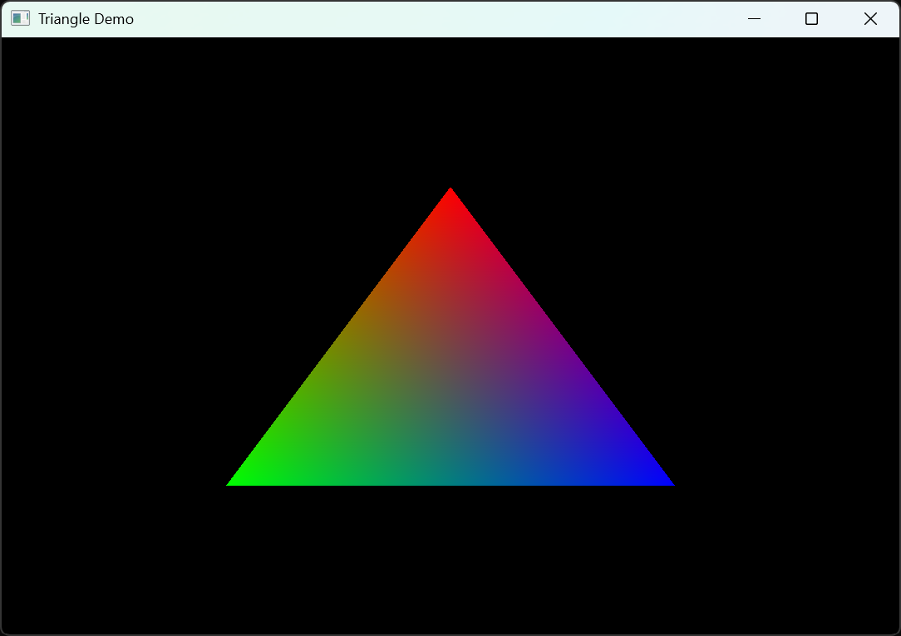

# VERA: C++20 Modern Vulkan Graphics Engine

A modern C++20 graphics engine built on Vulkan, designed for both 2D and 3D graphics projects. The engine provides a flexible, object-oriented API for rendering, resource management, and shader reflection.

## Features

- Vulkan-based rendering pipeline
- Support for 2D and 3D graphics
- Object-oriented resource management (devices, buffers, textures, pipelines)
- Shader reflection and parameter management
- Example projects for quick start

## Getting Started

### Prerequisites

- **Visual Studio 2019 or newer** (only Windows is currently supported)
- **Git** (for cloning with submodules)
- [Vulkan SDK](https://vulkan.lunarg.com/sdk/home) installed

### Clone the Repository

To ensure all dependencies are included, clone with submodules:


```
git clone --recursive https://github.com/dandevlog0206/vera.git
```

If you already cloned without `--recursive`, run:

```
git submodule update --init --recursive
```

### Build Instructions

1. Open the solution file (`vera.sln`) in Visual Studio.
2. Select your desired configuration (Debug/Release).
3. Build the solution.

## Examples
### Minimal source code to draw a triangle

#### main.cpp
```cpp
#include <vera/vera.h>

int main()
{
	vr::os::Window window(1080, 720, "Triangle Demo");

	auto device    = vr::Device::create(vr::Context::create());
	auto ctx       = vr::RenderContext::create(device);
	auto swapchain = vr::Swapchain::create(ctx, window);

	vr::GraphicsPass pass(device, vr::GraphicsPassCreateInfo{
		.vertexShader   = vr::Shader::create(device, "shaders/triangle_minimal.vert.glsl.spv"),
		.fragmentShader = vr::Shader::create(device, "shaders/triangle.frag.glsl.spv"),
		.vertexCount    = 3
	});

	
	while (!window.needClose()) {
		window.handleEvent();

		if (swapchain->isOccluded()) continue;
		
		pass.execute(ctx, swapchain->acquireNextImage());

		ctx->submit();
		swapchain->present();
	}

	return 0;
}
```

#### triangle_minimal.vert.glsl
``` glsl
#version 450

layout(location=0) out vec4 outColor;

struct Vertex
{
	vec2 pos;
	vec4 color;
};

Vertex vertices[] = {
	Vertex(vec2(0, -0.5), vec4(1.0, 0.0, 0.0, 1.0)),
	Vertex(vec2(-0.5, 0.5), vec4(0.0 , 1.0, 0.0, 1.0)),
	Vertex(vec2(0.5, 0.5), vec4(0.0, 0.0, 1.0, 1.0))
};

void main()
{
	gl_Position = vec4(vertices[gl_VertexIndex].pos,0.0, 1.0);
	outColor    = vertices[gl_VertexIndex].color;
}

```

#### triangle.frag.glsl
``` glsl
#version 450

layout(location = 0) in vec4 inColor;
layout(location = 0) out vec4 outColor;

void main()
{
	outColor = inColor;
}

```

### result


## License
This software is distributed under [MIT](https://en.wikipedia.org/wiki/MIT_License) license.